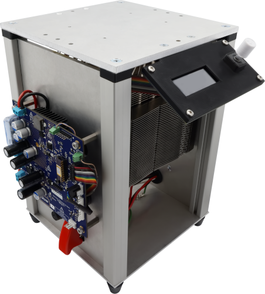
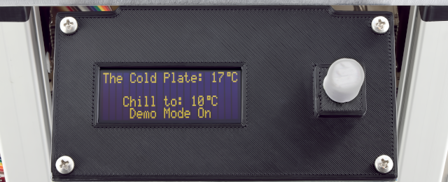
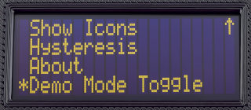
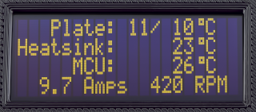
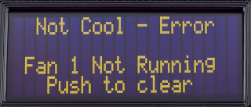

# Intelligent Cooling Plate with PIC16F17146

Packed with more peripherals than I/O pins, this intelligent cooling plate — the cold plate — cools its metal surface and anything on top of it. This system is controlled by a single 20-pin, 8-bit microcontroller (MCU), which performs temperature measurements, peltier current monitoring, user interface control and safety functions. The MCU can handle this task single-handedly due to its wide array of Core Independent Peripherals (CIPs).

This README covers a brief usage guide and other generic aspects of the intelligent cooling plate, presented through a demo. The design of the cold plate allows for different functionalities of the MCU to be transferable or adaptable to various applications, offering the user a wider potential of interaction more quickly at hand. The present example is not a guide on how to build up the hardware, but all Printed Circuit Board (PCB), Computer-Aided Design (CAD) files and nonstandard Bill of Materials (BOM) components are included in the repo for reference.

## Related Documentation
- [PIC16F17146 Family](https://www.microchip.com/en-us/products/microcontrollers-and-microprocessors/8-bit-mcus/pic-mcus/pic16f17146?utm_source=GitHub&utm_medium=TextLink&utm_campaign=MCU8_MMTCha_pic171xx&utm_content=pic16f17146-cold-plate-mplab-mcc-github)
- [EA OLEDM204 Data Sheet](https://www.lcd-module.de/fileadmin/html-seiten/eng/pdf/doma/oledm204-ae.pdf)
- [CP85435 Peltier Plate Data Sheet](https://www.cuidevices.com/product/resource/cp85.pdf)
- [PS103J2 NTC Thermistors](https://www.littelfuse.com/products/temperature-sensors/leaded-thermistors/interchangeable-thermistors/standard-precision-ps/ps103j2.aspx)

## Software Used
- [MPLAB&reg; X IDE v6.0.5](https://www.microchip.com/en-us/tools-resources/develop/mplab-x-ide?utm_source=GitHub&utm_medium=TextLink&utm_campaign=MCU8_MMTCha_pic171xx&utm_content=pic16f17146-cold-plate-mplab-mcc-github) or newer
- [MPLAB XC8 v2.36.0](https://www.microchip.com/en-us/tools-resources/develop/mplab-xc-compilers?utm_source=GitHub&utm_medium=TextLink&utm_campaign=MCU8_MMTCha_pic171xx&utm_content=pic16f17146-cold-plate-mplab-mcc-github) or newer
- [MPLAB Code Configurator](https://www.microchip.com/en-us/tools-resources/configure/mplab-code-configurator?utm_source=GitHub&utm_medium=TextLink&utm_campaign=MCU8_MMTCha_pic171xx&utm_content=pic16f17146-cold-plate-mplab-mcc-github) (MCC)
- [MPLAB Mindi&trade; Analog Simulator](https://www.microchip.com/en-us/tools-resources/develop/analog-development-tool-ecosystem/mplab-mindi-analog-simulator?utm_source=GitHub&utm_medium=TextLink&utm_campaign=MCU8_MMTCha_pic171xx&utm_content=pic16f17146-cold-plate-mplab-mcc-github)

## Development Hardware Used

- [PIC16F17146](https://www.microchip.com/en-us/product/PIC16F17146?utm_source=GitHub&utm_medium=TextLink&utm_campaign=MCU8_MMTCha_pic171xx&utm_content=pic16f17146-cold-plate-mplab-mcc-github)
- [Curiosity Development Board (DM164137)](https://www.microchip.com/en-us/development-tool/DM164137?utm_source=GitHub&utm_medium=TextLink&utm_campaign=MCU8_MMTCha_pic171xx&utm_content=pic16f17146-cold-plate-mplab-mcc-github) (used during development)

## Major Functions
These are the major functions that are implemented on the microcontroller.

**Current Monitoring and Measurement**  
- Integrated Operational Amplifier (OPAMP1)  
- Analog Comparators 1 and 2 (CMP1 and CMP2)  
- Digital-to-Analog Converters 1 and 2 (DAC1, DAC2) 
- Analog-to-Digital Converter with Computation (ADCC)
- Fixed Voltage Reference (FVR)

OPAMP1 is implemented as a current-sense amplifier, which outputs a magnified version of the small voltage across the current shunt resistor. The output of OPAMP1 is also used internally for monitoring and measurement. 

  

The amplified current sense output of OPAMP1 is compared to a small, set voltage level (from DAC1) using CMP1. If the output is greater, then CMP1 is high, indicating current is flowing through the system.

DAC2/CMP2 work in the same way, but are used to detect overcurrent. If the DAC2 value is exceeded by the output of OPAMP1, the MCU shuts down the Peltier plate.

Additionally, the current is measured for telemetry by the ADCC, with the FVR providing the appropriate voltage reference.

**Cold Plate, Heat Sink, and MCU Temperature Monitoring**
- Analog-to-Digital Converter with Computation (ADCC)
- Fixed Voltage Reference (FVR)
- Temperature Indicator Module (TEMP)

The microcontroller measures the temperature of the top plate and its heat sink using Negative Temperature Coefficient (NTC) thermistors. It also monitors the internal temperature of the MCU die with the TEMP peripheral. The ADCC uses the FVR to ensure measurements are stable, and to provide the appropriate voltage for the TEMP peripheral. 

**Functional Safety Supported Setting Storage**
- Cyclic Redundancy Check (CRC) with Memory Scanner 
- Nonvolatile Memory (NVM) Control

Using the NVM and CRC CIPs, user settings are saved to EEPROM along with a CRC checksum. On start-up, the checksum is revalidated for data integrity. The CRC reduces code size and runs faster than the software could perform, by offloading it to the dedicated hardware.
 
**Protective System Monitoring**
- Timer0 (TMR0)
- Windowed Watchdog Timer (WWDT)

Since the cold plate involves high currents and potentially hazardous temperatures, the WWDT is used to ensure periodic monitoring of the device is performed. If the WWDT is not triggered within a specific amount of time, the MCU resets. This way, if the firmware deadlocks, the system does not remain active, thus making sure safety is not compromised. TMR0 generates the base timing for the periodic self-check.

**Single-Speed Fan Control with Dual Fan Speed Monitoring**
- Pulse Width Modulator with Compare 2 (PWM2)
- Timer2 (TMR2) and Timer4 (TMR4)

To cool the Peltier plate, a PWM CIP is used to generate a speed control signal for the system fans. This allows the fans to ramp up and down depending on the conditions of the system. Additionally, the tachometer signals from the fans are monitored and counted by TMR2 and TMR4. If Fan 1 is not spinning (or stops spinning), the microcontroller will not power up the Peltier plate. 

**User Interface**
- Host Synchronous Serial Port 1 (MSSP1), in I2C mode
- Timer1 (TMR1) and Timer3 (TMR3)
- Configurable Logic Cell 1 and 2 (CLC1 and CLC2)
- Pulse Width Modulator with Compare 1 (PWM1)

The user interacts with the cold plate through a push button rotary encoder and an OLED display. The OLED is controlled with an on-chip MSSP1 peripheral via I2C. Since there is dedicated MSSP hardware, the CPU can load data into the module, rather than bit-banging the I/O lines. 

The rotary encoder inputs connect into two CLC CIPs to convert the signals into clockwise and counter-clockwise pulses (depending on direction). The pulses go into TMR1 and TMR3, which act as counters. The CPU can read the counters later to calculate the net rotation.

Lastly, the rotary encoder has two built-in LEDs—an orange and a blue LED. Using PWM1, these LEDs are used for a visual indication of the cold plate status:

| Color | Cold Plate Status |
| --- | --- |
| Breathing Purple | Standby |
| Breathing Blue | Actively Cooling |
| Solid Blue | At the Target Temperature |
| Solid Orange | Error |

**Debug Print**
- Enhanced Universal Synchronous Asynchronous Receiver
Transmitter (EUSART1)

EUSART1 is used to transmit debug messages from the MCU. It is set up to run at 115200 baud, 8 data bits and 1 stop bit.

## Operation

On boot, a standby screen shows the current plate temperature, the set temperature, and whether the product is in demo mode (which limits the lowest temperature for safety).

Pressing the rotary encoder button brings up a menu that can be used to change various running parameters:

| Name | Function |
| --- | --- |
| Go Back | Returns to Standby screen |
| Start | Turns on plate, goes to running status screen |
| Set Temperature | Changes target temperature |
| Hysteresis | Configures temperature hysteresis |
| Change Units | Selects Celsius or Fahrenheit units|
| Show Icons | Displays text or icons in running status screen |
| About | Lists developer and version info |
| Demo Mode Toggle | Password protected way to disable demo mode|

Upon pressing Start, the MCU begins checking for various errors. If all checks pass, the plate power is enabled and the user is brought to a running status screen which shows:

- Target temperature of the plate
- Current temperature of the plate
- MCU temperature
- Current Peltier current
- Cooling fan RPM

If an error occurs, power to the plate is cut, and a troubleshooting error message displays on the screen. Press the rotary encoder to clear the error and return to the standy screen. If the error is not remedied and the plate is started again, it will loop back to the same error screen.

Below is a list of the various possible errors that are continuously checked for during running operation:

| Name | Error Code | Cause |
| ---- | ----------- |--- |
| PELTIER_FAN1_ERROR | 1 | The heat sink fan is unplugged |
| PELTIER_OVERCURRENT_ERROR | 2 | More current is pulled than the software allows |
| PELTIER_POWER_ERROR | 3 | No power is detected when the plate should be pulling current |
| PELTIER_GAIN_ERROR | 4 | The gain of the operational amplifier exceeds expected tolerance
| PELTIER_INT_OVERHEAT | 5 | Internal MCU temperature is too hot (70&deg;C)|
| PELTIER_HEATSINK_OVERHEAT | 6 | Heat sink is too hot (80&deg;C)|
| PELTIER_SENSE_HOT_OPEN | 7 | Thermocouple for heat sink is disconnected |
| PELTIER_SENSE_COLD_OPEN | 8 | Thermocouple for plate temp is disconnected |
| PELTIER_PLATE_TEMP_LIMIT | 9 | Cold plate is below safe temperature |

Once started, pressing the rotary encoder button and selecting `Cancel` stops the plate and returns to the standby menu.

## Summary
This README covered a brief overview of the functionality of the cold plate and how to operate it.
